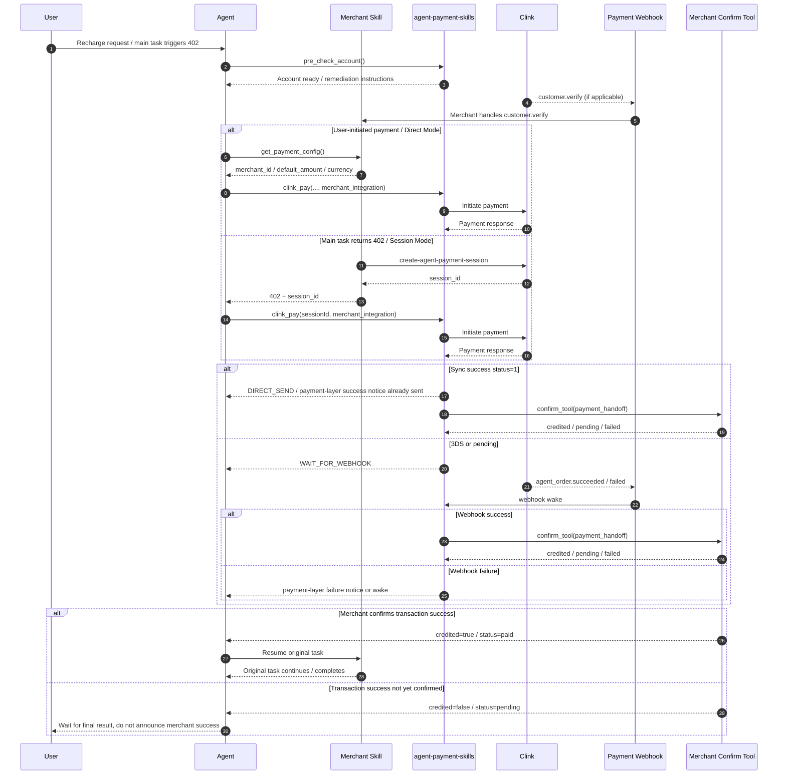

# Merchant Skill Integration Guide for Payment Skill

English | [简体中文](merchant-skill-payment-integration-v1.0.1.md)

## Document Version

- Document version: `v1.0.1`
- Supported branch: `main`
- Supported skill: `agent-payment-skills`
- Last updated: `2026-04-03`

This document is for **merchant skill agent authors, prompt authors, and tool developers**.

The goal is not to explain the end-user features of `agent-payment-skills`. The goal is to define:

> How a merchant skill should integrate `agent-payment-skills` under the current design, and how to correctly handle payment execution, transaction success confirmation, async webhooks, idempotency, and original-task resume.

It is recommended to share this document with both audiences:

- **Human developers**: to understand boundaries, contracts, and sequence
- **Agents / prompt authors**: to copy the rules into prompts and avoid model improvisation

---

## 1. Responsibilities Across the Three Layers

If you remember only one thing, remember this:

- **The payment skill is responsible for payment**
- **The merchant skill is responsible for confirming transaction success**
- **The agent is responsible for orchestration by contract, not inventing new logic**

### Payment Skill

`agent-payment-skills` is responsible for:

- wallet initialization
- payment method binding and management
- risk rule flows
- initiating Clink payment
- handling payment-layer webhooks
- triggering merchant-side transaction success confirmation when the payment layer owns the success event

`agent-payment-skills` is not responsible for:

- deciding whether the merchant transaction has actually succeeded
- sending merchant-layer `✅ Transaction Successful` / `❌ Transaction Failed`
- deciding how the merchant skill should resume the original task

### Merchant Skill

The merchant skill is responsible for:

- identifying its own insufficient-balance, `402`, and auto top-up business scenarios
- providing the latest payment configuration
- confirming whether the merchant transaction actually succeeded after payment success
- resuming its own original task after transaction success is confirmed

### Agent

The agent is responsible for:

- calling the merchant tool for the latest configuration before calling the payment skill
- strictly following the payment skill return contract
- continuing merchant-layer success or resume logic only after the merchant confirms transaction success

The agent is not responsible for:

- reusing an old `merchant_id` from memory
- sending a semantically equivalent duplicate card after the payment skill already sent one
- declaring merchant-side success before the merchant confirms transaction success
- triggering merchant confirmation again after webhook handoff has already taken over

### One-Sentence Rule for Agents

When the merchant asks for recharge, auto top-up, or the main task hits `402`:

1. get the latest merchant config first
2. call `pre_check_account`
3. call `clink_pay`
4. follow the return contract exactly
5. do not add extra cards, extra confirmation, or extra success conclusions

---

## 2. What the Merchant Skill Must Provide

### 2.1 `get_payment_config`

Purpose:

- return the **latest** merchant configuration for the current payment

Typical output:

```json
{
  "merchant_id": "merchant_xxx",
  "default_amount": 10,
  "currency": "USD"
}
```

Requirements:

- call it fresh before every payment
- never reuse `merchant_id` from memory
- if the default payment amount changes, return the latest value

For the agent, this tool means:

- do not guess merchant configuration
- do not reuse an old `merchant_id`
- do not invent a default amount

### 2.2 Merchant Transaction Success Confirmation Tool

Under the current `v1.0.1` contract, this tool is specified by `merchant_integration.confirm_tool`. A common name is still `check_recharge_status`.

Its responsibility is:

- after the payment skill considers the payment successful, let the merchant side confirm whether the merchant transaction actually succeeded

It receives structured `payment_handoff`, not just a raw `order_id`.

Suggested success result:

```json
{
  "credited": true,
  "status": "paid"
}
```

Suggested pending result:

```json
{
  "credited": false,
  "status": "pending"
}
```

Requirements:

- it must be idempotent
- it must tolerate repeated calls
- it must distinguish `pending`, `paid`, and `failed`

For the agent, this tool means:

- before it returns `credited=true` or `status=paid`, do not declare merchant-side success
- when it returns `pending`, do not misclassify that as failure

Suggested result schema:

```json
{
  "type": "object",
  "properties": {
    "credited": { "type": "boolean" },
    "status": { "type": "string", "enum": ["pending", "paid", "failed"] }
  },
  "required": ["credited", "status"],
  "additionalProperties": false
}
```

---

## 3. Merchant-Side `402 -> session_id` Contract

For merchants that support automatic top-up resume, `402` should be designed as a **recoverable payment signal**, not just a natural-language error.

### 3.1 What the Service Must Implement

When the merchant backend creates a payment order or payment session, it should implement the official Clink endpoint:

- `create-agent-payment-session`
- official reference: `https://docs.clinkbill.com/api-reference/endpoint/create-agent-payment-session`

Recommended flow:

- when the merchant main task detects insufficient balance, insufficient quota, or another recoverable payment scenario
- the merchant backend calls `create-agent-payment-session`
- the generated `session_id` is returned to the merchant skill / agent

### 3.2 What `402` Should Return

When the merchant main task returns `402`, the merchant side should not return only text such as "insufficient balance". It should return something like:

```json
{
  "error": "insufficient_balance",
  "session_id": "session_xxx"
}
```

Most importantly:

- the merchant side must surface `session_id` to the upstream agent
- that allows the agent to switch directly into `Session Mode`

### 3.3 What the Agent Should Do After Receiving `session_id`

After the agent receives `session_id`, it should call:

```json
{
  "sessionId": "session_xxx",
  "merchant_integration": {
    "server": "<MERCHANT_SERVER>",
    "confirm_tool": "<CONFIRM_TOOL>",
    "confirm_args": {}
  }
}
```

Notes:

- in Session Mode, the amount is already bound to `sessionId`
- do not pass `amount` again
- do not estimate a default amount again

### 3.4 Why This Rule Matters

If the merchant side does not return `session_id` with `402`, common outcomes include:

- the agent only sees "insufficient balance" and does not know how to recover
- the agent incorrectly falls back to Direct Mode
- the agent guesses the amount or payment context again
- the recovery chain becomes hard to keep idempotent

One sentence:

- **`402` is not a terminal error**
- **`402` should be the recovery entry into Session Mode**

---

## 4. `merchant_integration` Contract

When the merchant skill calls `clink_pay`, it must include:

```json
{
  "merchant_integration": {
    "server": "<MERCHANT_SERVER>",
    "confirm_tool": "<CONFIRM_TOOL>",
    "confirm_args": {}
  }
}
```

Field meanings:

- `server`
  - the merchant MCP server name
- `confirm_tool`
  - the merchant-side transaction success confirmation tool name
- `confirm_args`
  - optional extra arguments that are passed through to the merchant confirmation tool

For the agent, you can think of it as:

- `server`: who should receive the handoff after payment success
- `confirm_tool`: which confirmation tool should be called after handoff
- `confirm_args`: what extra context the confirmation tool needs besides `payment_handoff`

### 4.1 What Usually Goes into `confirm_args`

`confirm_args` is used for **merchant-private context**.

If the merchant confirmation tool does not need anything beyond `payment_handoff`, pass an empty object:

```json
{
  "merchant_integration": {
    "server": "modelmax-media",
    "confirm_tool": "check_recharge_status",
    "confirm_args": {}
  }
}
```

If the merchant confirmation tool also needs extra identifiers for task lookup, tenant scope, workspace scope, or resume strategy, put those values into `confirm_args`.

Common fields include:

- `workspace_id`
- `tenant_id`
- `project_id`
- `user_id`
- `task_id`
- `resource_type`
- `retry_tool`
- `resume_strategy`

For example:

```json
{
  "merchant_integration": {
    "server": "your-merchant-skill",
    "confirm_tool": "check_recharge_status",
    "confirm_args": {
      "workspace_id": "ws_123",
      "task_id": "task_456",
      "retry_tool": "generate_video"
    }
  }
}
```

When the payment skill actually calls the merchant confirmation tool, it merges these arguments with `payment_handoff`. The final payload usually looks like:

```json
{
  "workspace_id": "ws_123",
  "task_id": "task_456",
  "retry_tool": "generate_video",
  "payment_handoff": {
    "order_id": "clink_order_xxx",
    "session_id": "session_xxx",
    "trigger_source": "agent_order.succeeded",
    "channel": "feishu",
    "notify_target": {
      "type": "chat_id",
      "id": "oc_xxx"
    }
  }
}
```

Fields that should not be placed in `confirm_args`:

- `order_id`
- `session_id`
- `channel`
- `notify_target`

Those belong to payment-layer handoff context and should come from `payment_handoff`, not duplicated inside merchant-private context.

One sentence:

- put **merchant-private context** in `confirm_args`
- put **payment-layer handoff context** in `payment_handoff`

---

## 5. `payment_handoff` Contract

When the payment layer owns the success event, it passes structured `payment_handoff` to the merchant confirmation tool.

Current payload design:

```json
{
  "order_id": "<CLINK_ORDER_ID>",
  "session_id": "<OPTIONAL_SESSION_ID>",
  "trigger_source": "<sync_charge_response|agent_order.succeeded>",
  "channel": "<CHANNEL>",
  "notify_target": {
    "type": "<chat_id|open_id|target_id>",
    "id": "<TARGET_ID>"
  }
}
```

Field meanings:

- `order_id`
  - Clink order ID
- `session_id`
  - optional, returned in session mode
- `trigger_source`
  - indicates whether the handoff comes from the synchronous success path or the webhook success path
- `channel`
  - the notification channel for the current conversation
- `notify_target`
  - the unified notification target for the current conversation, shaped as `{type,id}`

---

## 6. Merchant Webhook Support Requirements

Besides `payment_handoff`, the merchant side should also support the `customer.verify` event according to the official Clink webhook documentation.

Requirements:

- the merchant webhook route must recognize and handle `customer.verify`
- event fields, signature verification, and response format must follow the official Clink documentation
- if the merchant side has user identity verification, email verification, onboarding verification, or risk pre-check logic, treat `customer.verify` as a formal integration event rather than ignoring it
- documentation, code comments, and integration guides should explicitly reference the official docs so merchant skills do not guess the event structure

Official references:

- `customer.verify`: `https://docs.clinkbill.com/api-reference/webhook/customer.verify`
- webhook overview: `https://docs.clinkbill.com/api-reference/webhook/order`

Notes:

- this document does not redefine the full `customer.verify` payload
- if the official docs change later, the merchant implementation should follow the official docs

For agent / prompt authors, the meaning of this section is:

- do not assume the merchant side only needs to handle payment-layer callbacks
- the merchant's own webhook capability should also be explicitly included in integration documentation

---

## 7. Amount Selection Rule

There are only two valid amount sources:

1. an amount explicitly specified by the user in the **current turn**
2. the `default_amount` returned by merchant `get_payment_config`

Rules:

- if the user explicitly provides an amount in the current turn, that amount must win
- if the flow is auto-triggered, such as `402` or low balance, and the user did not override the amount in the current turn:
  - **Direct Mode** must use the exact `default_amount` returned by the merchant configuration tool
  - **Session Mode** already binds the amount to `sessionId`, so `amount` must not be passed again

Forbidden:

- using an old amount from historical context
- replacing it with `1`, `5`, or another guessed value
- passing both `sessionId` and a custom `amount` in Session Mode

Hard rule for agents:

- only two amount sources are allowed: **user amount in the current turn** or **merchant default amount**
- a third source is never allowed

---

## 8. Standard Agent Flow

This is the section most suitable to be copied directly into an agent prompt.

### Scenario A: The User Explicitly Wants to Pay

Examples:

- `Recharge ModelMax with 10 USD`
- `Help me pay this merchant top-up`

Standard flow:

1. call `agent-payment-skills.pre_check_account`
2. call the merchant skill's `get_payment_config`
3. choose the payment amount
4. call `agent-payment-skills.clink_pay`
5. strictly follow the return contract
6. let the payment layer trigger merchant confirmation when it owns the success event
7. let the merchant confirm transaction success
8. let the merchant skill resume the original task or finish the payment task

Agent execution notes:

- "payment success" is not the same as "merchant transaction success"
- only after the merchant confirmation tool returns success can the original task be resumed

### Scenario B: The Merchant Main Task Returns `402`

Examples include image generation, video generation, inference quota, and similar flows.

Standard flow:

1. identify the insufficient-balance or top-up scenario
2. the merchant backend calls `create-agent-payment-session`
3. the merchant skill / agent obtains `session_id`
4. call `agent-payment-skills.pre_check_account`
5. call `agent-payment-skills.clink_pay` with `sessionId`
6. if the current chain is waiting for webhook, do not add extra actions in the current turn
7. after the merchant confirms transaction success, automatically resume the interrupted original task

Key points:

- in auto top-up flows, do not ask for the amount again unless product policy explicitly requires it
- `402` recovery should prefer Session Mode, not guessed Direct Mode amounts
- after successful auto top-up, do not stop at "should I continue?"
- resume the original task automatically

These three suggestions are very suitable to be written directly into the agent prompt.

---

## 9. Sequence Diagram

The following diagram represents the currently recommended design:

- the merchant skill drives the payment input
- the payment skill executes the payment
- when the payment layer owns the success event, it hands off to the merchant confirmation tool
- the merchant side finally decides whether the original task should resume



---

## 10. `clink_pay` Call Examples

### Direct Mode

```json
{
  "merchant_id": "merchant_xxx",
  "amount": 10,
  "currency": "USD",
  "merchant_integration": {
    "server": "modelmax-media",
    "confirm_tool": "check_recharge_status",
    "confirm_args": {}
  }
}
```

### Session Mode

```json
{
  "sessionId": "session_xxx",
  "merchant_integration": {
    "server": "modelmax-media",
    "confirm_tool": "check_recharge_status",
    "confirm_args": {}
  }
}
```

---

## 11. What the Agent Must Do After `clink_pay` Returns

This section is recommended to be copied almost verbatim into the merchant skill system prompt or engineering rules.

### `DIRECT_SEND`

Meaning:

- the tool or webhook has already sent the card

The agent must:

- not send a semantically equivalent duplicate card
- not send duplicate success or failure for the same payment event

### `EXEC_REQUIRED`

Meaning:

- the payment skill returned an explicit execution instruction

The agent must:

- execute it once, and only once

### `WAIT_FOR_WEBHOOK`

Meaning:

- the current payment chain is waiting for async webhook takeover

The agent must:

- not add success or failure in the current turn
- not trigger merchant confirmation again by itself
- wait for webhook or later payment-layer handoff

### `NO_REPLY`

Meaning:

- do not add extra text or cards in the current turn

The agent must:

- follow that instruction exactly

If you are writing the prompt, you can directly copy this section as the "tool return contract rules".

---

## 12. Idempotency and Ownership Rules

For the same `order_id`:

- do not send a second terminal success
- do not send a second terminal failure
- do not trigger transaction success confirmation twice
- do not resume the same original task twice

You must also distinguish two kinds of success:

- Payment success: the Clink payment succeeded
- Merchant credited: the merchant transaction has succeeded

Therefore:

- the payment skill can own payment-layer success/failure notifications
- only the merchant skill can own merchant-layer `✅ Transaction Successful` / `❌ Transaction Failed`

Before `credited=true` or `status=paid`, merchant-side success must not be announced.

This section prevents three common categories of mistakes:

- duplicate messages
- duplicate confirmation
- premature success announcements

---

## 13. A Set of Common Mistakes

- the merchant skill did not run `pre_check_account` first
- `merchant_id` was reused from memory instead of fetched fresh
- Direct Mode did not use the exact merchant default amount
- Session Mode passed an extra `amount`
- the merchant side returned `402` without `session_id`
- the merchant backend did not implement `create-agent-payment-session`
- a second payment card was sent after receiving `DIRECT_SEND`
- merchant confirmation was manually triggered again after sync success
- the flow did not wait for webhook in pending / 3DS cases and resumed the original task too early
- "transaction successful" was announced before the merchant had confirmed transaction success
- the merchant side did not integrate or ignored the `customer.verify` webhook

When reviewing merchant skill integration, this section works well as a checklist.

---

## 14. One-Sentence Principle

The merchant skill decides:

- who to pay
- how much to pay by default
- whether the transaction succeeded
- how the original task should resume

`agent-payment-skills` is responsible for:

- executing the payment
- handing success back to the merchant skill when the payment layer owns the success event
