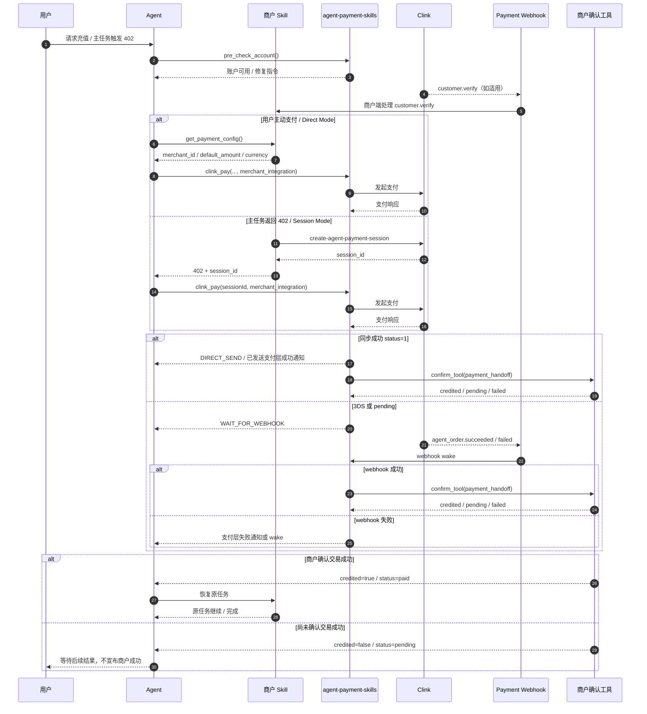

# 商户 Skill 集成 Payment Skill 指南

简体中文

## 文档版本

- 文档版本：`v1.0.1`
- 适用分支：`main`
- 适用 skill：`agent-payment-skills`
- 最后更新：`2026-04-03`

本文面向**商户 Skill 的 Agent 作者、Prompt 作者、工具开发者**。

目标不是介绍 `agent-payment-skills` 的用户功能，而是说明：

> 商户 Skill 应该如何按当前设计接入 `agent-payment-skills`，并正确处理支付执行、交易成功确认、异步 webhook、幂等与原任务恢复。

建议把这份文档同时给两类读者看：

- **人类开发者**：理解职责边界、contract 和时序
- **Agent / Prompt 作者**：直接把里面的规则写进提示词，避免模型自己补逻辑

---

## 1. 三层职责

如果只记一条，请记住：

- **Payment Skill 负责支付**
- **商户 Skill 负责确认交易成功**
- **Agent 负责按 contract 编排，不负责发明新逻辑**

### Payment Skill

`agent-payment-skills` 负责：

- 钱包初始化
- 支付方式绑定和管理
- 风控规则流程
- 发起 Clink 支付
- 处理支付层 webhook
- 在拥有成功事件时触发商户交易成功确认

`agent-payment-skills` 不负责：

- 判定商户交易是否已经成功
- 发送商户层语义的 `✅ 交易成功` / `❌ 交易失败`
- 替商户 Skill 决定主任务恢复逻辑

### 商户 Skill

商户 Skill 负责：

- 识别自己的余额不足、`402`、自动充值等业务场景
- 提供最新的支付配置
- 在支付成功后确认商户交易是否真正成功
- 交易成功后恢复自己的原任务

### Agent

Agent 负责：

- 先调用商户工具拿最新配置，再调用 payment skill
- 严格遵守 payment skill 返回契约
- 只在商户确认交易成功后继续商户层成功/恢复逻辑

Agent 不负责：

- 用记忆复用旧的 `merchant_id`
- 在 payment skill 已经发卡后再补一张等价卡片
- 在商户确认交易成功前擅自宣布商户侧成功
- 在 webhook 接管后重复触发商户确认

### 给 Agent 的一句话规则

当商户请求充值、自动充值或主任务出现 `402` 时：

1. 先拿商户最新配置
2. 再调用 `pre_check_account`
3. 再调用 `clink_pay`
4. 返回什么就严格按什么执行
5. 不要自己补卡片、补确认、补成功结论

---

## 2. 商户 Skill 需要提供什么

### 2.1 `get_payment_config`

作用：

- 返回本次支付应使用的**最新**商户配置

典型输出：

```json
{
  "merchant_id": "merchant_xxx",
  "default_amount": 10,
  "currency": "USD"
}
```

要求：

- 每次支付前重新调用
- `merchant_id` 不得从记忆复用
- 默认支付金额变化时必须返回最新值

对 Agent 来说，这个工具的意义是：

- 不要猜商户配置
- 不要复用旧 `merchant_id`
- 不要自己拍脑袋决定默认金额

### 2.2 商户交易成功确认工具

在当前 `v1.0.1` 契约里，这个工具由 `merchant_integration.confirm_tool` 指定，常见名字仍然是 `check_recharge_status`。

它的职责是：

- 在 payment skill 认为支付成功后，由商户侧确认交易是否真正成功

它会收到结构化的 `payment_handoff`，而不是只收一个裸 `order_id`。

建议结果：

```json
{
  "credited": true,
  "status": "paid"
}
```

或：

```json
{
  "credited": false,
  "status": "pending"
}
```

要求：

- 必须幂等
- 必须能处理重复调用
- 必须区分 `pending`、`paid`、`failed`

对 Agent 来说，这个工具的意义是：

- 在它返回 `credited=true` 或 `status=paid` 前，不要宣布商户侧成功
- 它返回 `pending` 时，不要误判为失败

建议结果约束：

```json
{
  "type": "object",
  "properties": {
    "credited": { "type": "boolean" },
    "status": { "type": "string", "enum": ["pending", "paid", "failed"] }
  },
  "required": ["credited", "status"],
  "additionalProperties": false
}
```

---

## 3. 商户端 `402 -> session_id` 契约

对于需要自动充值恢复的商户，推荐把 `402` 设计成**可恢复支付信号**，而不是只返回一段自然语言错误。

### 3.1 服务端需要实现什么

商户服务端在创建支付订单/支付会话时，应实现 Clink 官方接口：

- `create-agent-payment-session`
- 官方文档：`https://docs.clinkbill.com/api-reference/endpoint/create-agent-payment-session`

推荐做法：

- 当商户主任务检测到余额不足、额度不足或其他可恢复支付场景时
- 由商户服务端调用 `create-agent-payment-session`
- 把生成的 `session_id` 返回给商户 Skill / Agent

### 3.2 `402` 时应该返回什么

当商户主任务返回 `402` 时，商户端不应只返回“余额不足”文本，而应尽量返回：

```json
{
  "error": "insufficient_balance",
  "session_id": "session_xxx"
}
```

最重要的是：

- 必须把 `session_id` 吐给上层 Agent
- 这样 Agent 才能立即改走 `Session Mode`

### 3.3 Agent 收到 `session_id` 后怎么做

Agent 收到 `session_id` 后，应直接调用：

```json
{
  "sessionId": "session_xxx",
  "merchant_integration": {
    "server": "<MERCHANT_SERVER>",
    "confirm_tool": "<CONFIRM_TOOL>",
    "confirm_args": {}
  }
}
```

注意：

- Session Mode 下金额已经绑定在 `sessionId` 上
- 不要再额外传 `amount`
- 不要自己再重新估算默认金额

### 3.4 这条规则为什么重要

如果商户端 `402` 时不返回 `session_id`，常见后果是：

- Agent 只能看到“余额不足”，却不知道如何恢复
- Agent 会错误地退回 Direct Mode
- Agent 可能重新猜金额、重新猜支付上下文
- 支付恢复链路难以保证幂等

一句话：

- **402 不是终态报错**
- **402 应该是进入 Session Mode 的恢复入口**

---

## 4. `merchant_integration` 契约

商户 Skill 调用 `clink_pay` 时，必须带上：

```json
{
  "merchant_integration": {
    "server": "<MERCHANT_SERVER>",
    "confirm_tool": "<CONFIRM_TOOL>",
    "confirm_args": {}
  }
}
```

字段说明：

- `server`
  - 商户 MCP server 名称
- `confirm_tool`
  - 商户侧交易成功确认工具名
- `confirm_args`
  - 可选，透传给商户确认工具的额外参数

对 Agent 来说，可以把它理解成：

- `server`：支付成功后要把结果交还给谁
- `confirm_tool`：交还后调用哪个确认工具
- `confirm_args`：确认工具除了 `payment_handoff` 之外还需要什么上下文

### 4.1 `confirm_args` 一般传什么

`confirm_args` 用来放**商户侧私有上下文**。

如果商户确认工具除了 `payment_handoff` 之外，不需要其他额外信息，直接传空对象即可：

```json
{
  "merchant_integration": {
    "server": "modelmax-media",
    "confirm_tool": "check_recharge_status",
    "confirm_args": {}
  }
}
```

如果商户确认工具还需要额外定位任务、租户、工作区或恢复策略，可以把这些值放进 `confirm_args`。

常见可传字段：

- `workspace_id`
- `tenant_id`
- `project_id`
- `user_id`
- `task_id`
- `resource_type`
- `retry_tool`
- `resume_strategy`

例如：

```json
{
  "merchant_integration": {
    "server": "your-merchant-skill",
    "confirm_tool": "check_recharge_status",
    "confirm_args": {
      "workspace_id": "ws_123",
      "task_id": "task_456",
      "retry_tool": "generate_video"
    }
  }
}
```

payment skill 在真正调用商户确认工具时，会自动把这些参数与 `payment_handoff` 合并。因此商户确认工具最终收到的参数通常类似：

```json
{
  "workspace_id": "ws_123",
  "task_id": "task_456",
  "retry_tool": "generate_video",
  "payment_handoff": {
    "order_id": "clink_order_xxx",
    "session_id": "session_xxx",
    "trigger_source": "agent_order.succeeded",
    "channel": "feishu",
    "notify_target": {
      "type": "chat_id",
      "id": "oc_xxx"
    }
  }
}
```

不建议放进 `confirm_args` 的字段：

- `order_id`
- `session_id`
- `channel`
- `notify_target`

这些字段都属于支付层回传上下文，应通过 `payment_handoff` 获得，不要和商户私有上下文重复定义。

一句话：

- `confirm_args` 放**商户私有上下文**
- `payment_handoff` 放**支付层回传上下文**

---

## 5. `payment_handoff` 契约

支付层在拥有成功事件时，会把结构化的 `payment_handoff` 传给商户确认工具。

当前 payload 设计：

```json
{
  "order_id": "<CLINK_ORDER_ID>",
  "session_id": "<OPTIONAL_SESSION_ID>",
  "trigger_source": "<sync_charge_response|agent_order.succeeded>",
  "channel": "<CHANNEL>",
  "notify_target": {
    "type": "<chat_id|open_id|target_id>",
    "id": "<TARGET_ID>"
  }
}
```

字段说明：

- `order_id`
  - Clink 订单号
- `session_id`
  - 可选，会话模式下回传
- `trigger_source`
  - 表明 handoff 来自同步成功路径还是 webhook 成功路径
- `channel`
  - 当前会话的通知通道
- `notify_target`
  - 当前会话的通知目标，结构统一为 `{type,id}`

---

## 6. 商户端 Webhook 支持要求

除 `payment_handoff` 外，商户端还应按 Clink 官方 webhook 文档支持 `customer.verify` 事件。

要求：

- 商户端 webhook 路由必须能够识别并处理 `customer.verify`
- 事件字段、签名校验、响应格式应以 Clink 官方文档为准
- 如果商户侧存在用户实名、邮箱校验、开户校验或风控前置校验流程，应把 `customer.verify` 视为正式事件接入，而不是忽略
- 文档、代码注释、对接说明中都应明确引用官方文档，避免各商户 Skill 自行猜测事件结构

官方文档：

- `customer.verify`：`https://docs.clinkbill.com/api-reference/webhook/customer.verify`
- Webhooks 总览：`https://docs.clinkbill.com/api-reference/webhook/order`

说明：

- 这里不在本文重复定义 `customer.verify` 的完整 payload
- 若官方文档后续更新，应以官方文档为准同步调整商户实现

对 Agent / Prompt 作者来说，这一节的含义是：

- 不要假设商户端只需要处理 payment layer 的回调
- 商户侧自己的 webhook 能力也要在接入文档里明确写清楚

---

## 7. 金额选择规则

只有两个合法来源：

1. 用户在**当前轮次**明确指定的金额
2. 商户 `get_payment_config` 返回的 `default_amount`

规则：

- 如果用户本轮明确给了金额，必须优先使用用户金额
- 如果是自动触发（如 `402` / low-balance）且用户本轮没有覆盖金额：
  - **Direct Mode** 必须使用商户配置工具返回的精确 `default_amount`
  - **Session Mode** 金额已经绑定在 `sessionId` 上，不能再额外传 `amount`

禁止：

- 用历史上下文里的旧金额
- 自己替换成 `1`、`5` 或其他经验值
- 在 Session Mode 下同时传 `sessionId` 和一个自定义 `amount`

给 Agent 的硬规则：

- 只允许两个金额来源：**用户本轮明确金额** 或 **商户返回的默认金额**
- 绝不允许第三个来源

---

## 8. Agent 的标准调用流程

这一节是最适合直接翻成 Agent 提示词的部分。

### 场景 A：用户主动要求支付

例如：

- `给 ModelMax 充值 10 美元`
- `帮我支付这笔商户补款`

标准流程：

1. 调用 `agent-payment-skills.pre_check_account`
2. 调用商户 Skill 的 `get_payment_config`
3. 选择支付金额
4. 调用 `agent-payment-skills.clink_pay`
5. 严格按返回契约处理
6. 由 payment layer 在拥有成功事件时触发商户确认
7. 商户确认交易成功
8. 商户 Skill 恢复原任务或结束支付任务

Agent 执行时要注意：

- 这里的“支付成功”不等于“商户交易成功”
- 只有商户确认工具返回成功，才能进入恢复原任务

### 场景 B：商户主任务返回 `402`

例如图片生成、视频生成、推理额度等场景。

标准流程：

1. 识别余额不足或补款场景
2. 商户服务端调用 `create-agent-payment-session`
3. 商户 Skill / Agent 拿到 `session_id`
4. 调用 `agent-payment-skills.pre_check_account`
5. 使用 `sessionId` 调用 `agent-payment-skills.clink_pay`
6. 若当前链路等待 webhook，则当前轮不再补动作
7. 商户确认交易成功后，自动恢复被中断的原任务

关键点：

- 自动补款场景不要再次追问金额，除非产品策略明确要求
- `402` 恢复应优先走 Session Mode，而不是重新猜 Direct Mode 金额
- 自动补款成功后不要停在“还要不要继续”
- 应自动恢复原任务

这三条建议非常适合直接写入 Agent Prompt。

---

## 9. 时序图

下面这个时序图表达的是当前推荐设计：

- 商户 Skill 驱动支付输入
- payment skill 执行支付
- 支付层在拥有成功事件时 handoff 给商户确认工具
- 商户侧最终决定是否恢复原任务



---

## 10. `clink_pay` 调用示例

### Direct Mode

```json
{
  "merchant_id": "merchant_xxx",
  "amount": 10,
  "currency": "USD",
  "merchant_integration": {
    "server": "modelmax-media",
    "confirm_tool": "check_recharge_status",
    "confirm_args": {}
  }
}
```

### Session Mode

```json
{
  "sessionId": "session_xxx",
  "merchant_integration": {
    "server": "modelmax-media",
    "confirm_tool": "check_recharge_status",
    "confirm_args": {}
  }
}
```

---

## 11. `clink_pay` 返回后，Agent 必须如何处理

这一节建议原样写进商户 Skill 的系统提示词或开发规范。

### `DIRECT_SEND`

含义：

- tool 或 webhook 已经把卡片发出去了

Agent 必须：

- 不再补发语义等价卡片
- 不再重复发送同一支付事件的成功/失败

### `EXEC_REQUIRED`

含义：

- payment skill 返回了明确的执行指令

Agent 必须：

- 执行一次，而且只能执行一次

### `WAIT_FOR_WEBHOOK`

含义：

- 当前支付链路要等待异步 webhook 接管

Agent 必须：

- 当前轮不要补发成功或失败
- 不要自己再次触发商户确认
- 等 webhook 或 payment layer 后续 handoff

### `NO_REPLY`

含义：

- 当前轮不要补额外文本或卡片

Agent 必须：

- 原样遵守

如果你在写 Prompt，可以直接把这一节作为“工具返回契约规则”复制进去。

---

## 12. 幂等和归属规则

对同一 `order_id`：

- 不得发送第二次终态成功
- 不得发送第二次终态失败
- 不得重复触发交易成功确认
- 不得重复恢复同一个原任务

同时必须区分两种成功：

- Payment success：Clink 支付成功
- Merchant credited：商户交易已经成功

因此：

- payment skill 可以拥有支付层成功/失败通知
- 商户 Skill 才能拥有商户层 `✅ 交易成功` / `❌ 交易失败`

在 `credited=true` 或 `status=paid` 之前，不得宣布商户侧成功。

这一节本质上是在防三类常见错误：

- 重复发消息
- 重复确认
- 提前宣布成功

---

## 13. 一组最常见的错误

- 商户 Skill 没有先做 `pre_check_account`
- `merchant_id` 不是现查，而是从记忆里拿
- Direct Mode 没用商户返回的精确默认金额
- Session Mode 额外又传了 `amount`
- 商户端返回 `402` 时没有提供 `session_id`
- 商户服务端没有实现 `create-agent-payment-session`
- 收到 `DIRECT_SEND` 后又补发了一张支付卡片
- 同步成功后又手动触发一次商户确认
- Pending / 3DS 流程里没有等 webhook，提前继续原任务
- 商户尚未确认交易成功就宣布“交易成功”
- 商户端没有接入或忽略 `customer.verify` webhook

建议在评审商户 Skill 接入时，按这一节逐条过 checklist。

---

## 14. 一句话原则

商户 Skill 自己决定：

- 给谁付
- 默认付多少
- 是否交易成功
- 原任务如何恢复

`agent-payment-skills` 负责：

- 把支付做掉
- 在拥有成功事件时，把成功 handoff 回商户 Skill
